<div align="center">

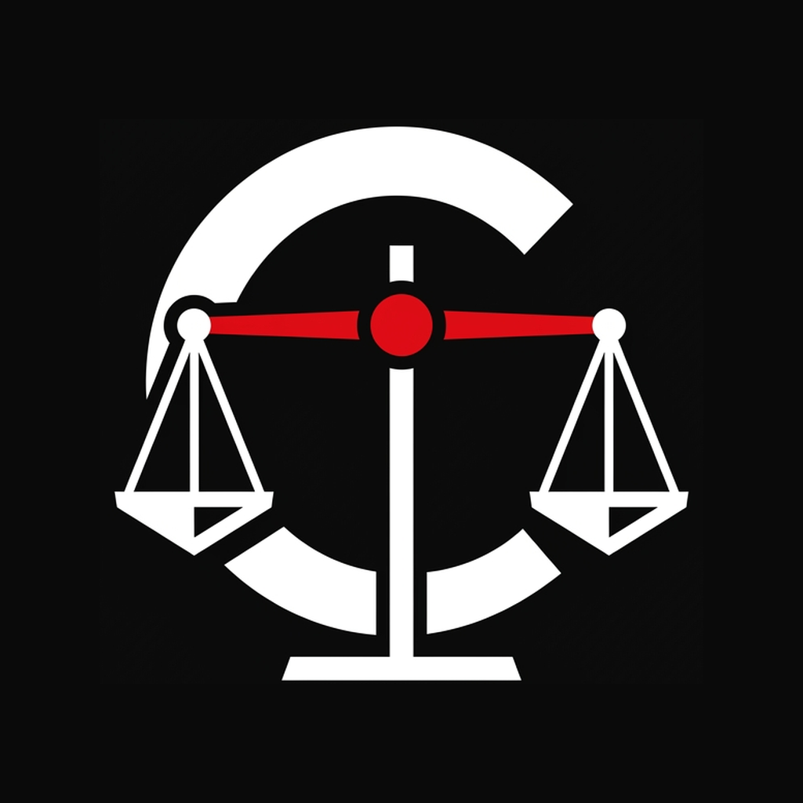

# CounselPro

### The Verified Legal Consultation & Case Management Platform

**LegalTech • Case Management • Verified Advocate Matching • Zero-Trust Privacy**

[](https://github.com/bhatnagar-built/counselpro-app-showcase)
[](https://github.com/bhatnagar-built/counselpro-app-showcase)
[](docs/PRIVACY.md)

</div>

---

## 📖 Introduction

**CounselPro** is a modern LegalTech application designed to bridge the gap between verified legal practitioners and individuals or corporate clients seeking trusted legal counsel. By unifying Bar Council credential verification, an encrypted case vault, automated 4-stage litigation tracking, an AI-powered legal assistant, and a milestone-based retainer wallet into a single cross-platform experience, CounselPro brings clarity, speed, and privacy to legal workflows.

> [!NOTE]
> **Showcase Repository Notice**  
> This repository is a **public product showcase** for CounselPro. It contains architectural documentation, visual previews, workflow specifications, and design assets. The application source code, proprietary algorithms, and backend services remain private.

---

## 📱 Product Preview

Every screen shown below is captured from the real, running CounselPro application using simulated and fully sanitized demonstration data.

### 🌟 Core Experience

| 01. Smart Onboarding | 02. Client Home Dashboard |
|:---:|:---:|
| 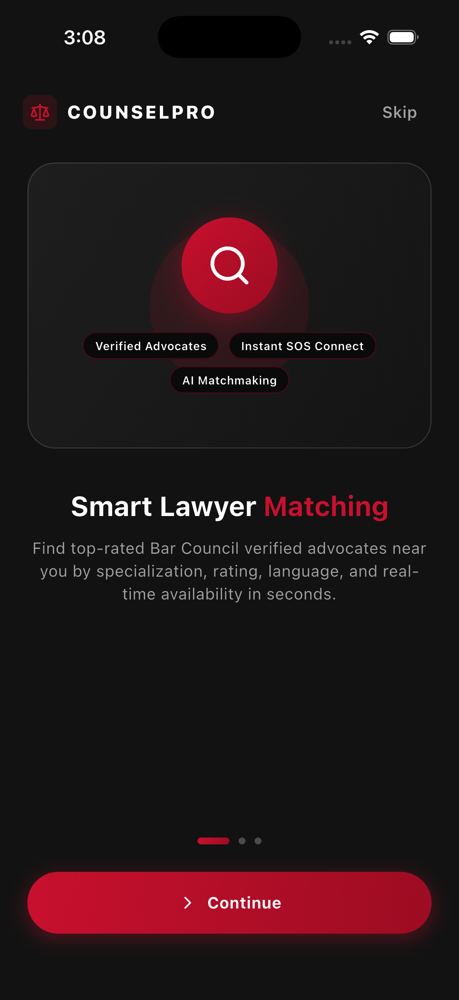 | 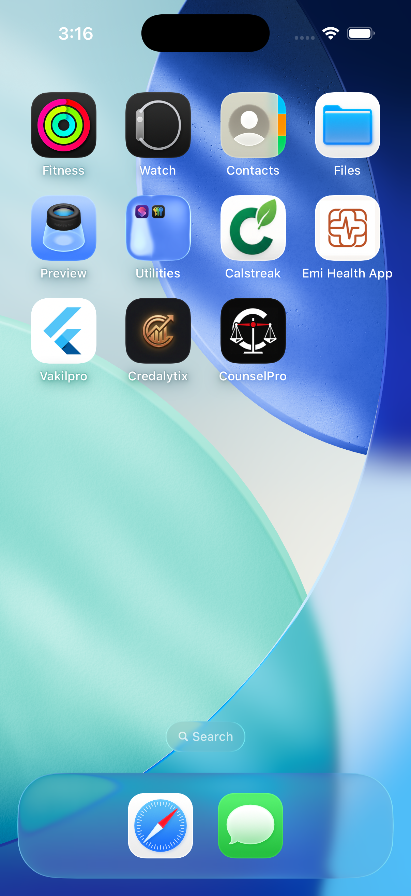 |
| *Personalized onboarding with practice specialization highlights* | *Active matters, upcoming hearings, AI assistant launcher, and verified counsel* |

---

### 🤖 AI Legal Assistant & 🔍 Advocate Discovery

| 03. 24/7 AI Legal Assistant | 04. Verified Advocate Search |
|:---:|:---:|
| 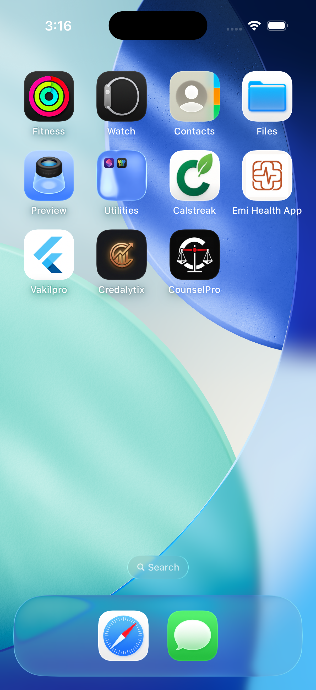 | 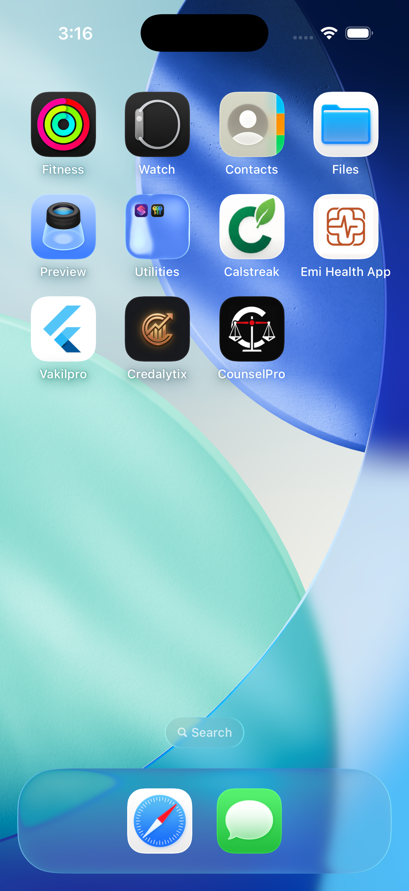 |
| *Statutory citation summaries, contract OCR insights, and contextual legal Q&A* | *Bar Council verification badges, practice filters, jurisdiction admissions, and hourly fees* |

---

### ⚖️ Matter Progression & 🔒 Encrypted Document Vault

| 05. 4-Stage Case Tracking | 06. Encrypted Case Vault |
|:---:|:---:|
| 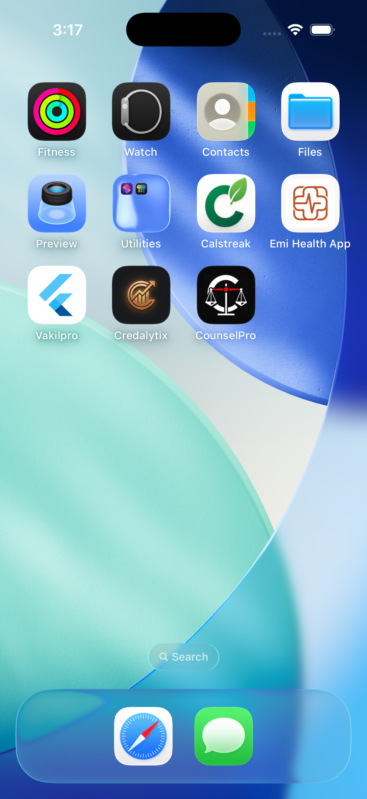 | 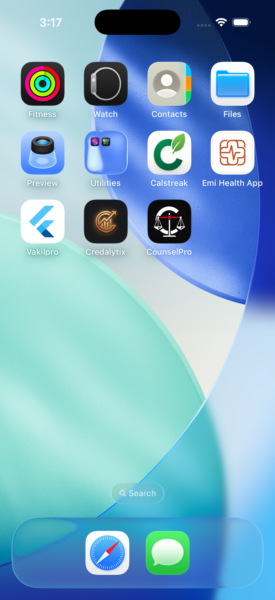 |
| *Clear milestone lifecycle: Filed ➔ Review ➔ Hearing Scheduled ➔ Resolved* | *Client-isolated encrypted storage for pleadings, contracts, orders, and evidence* |

---

### 🚨 Emergency Legal SOS & 💳 Retainer Escrow Wallet

| 07. Emergency Legal SOS | 08. Retainer & Escrow Wallet |
|:---:|:---:|
| 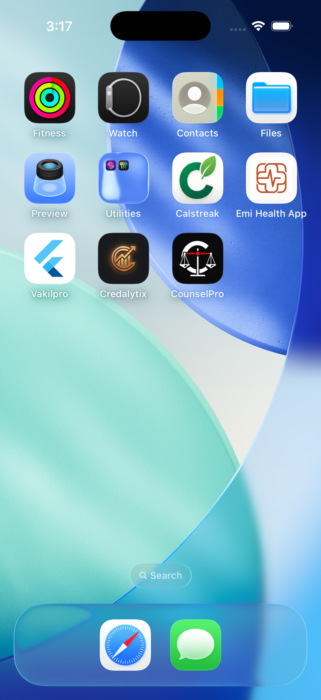 | 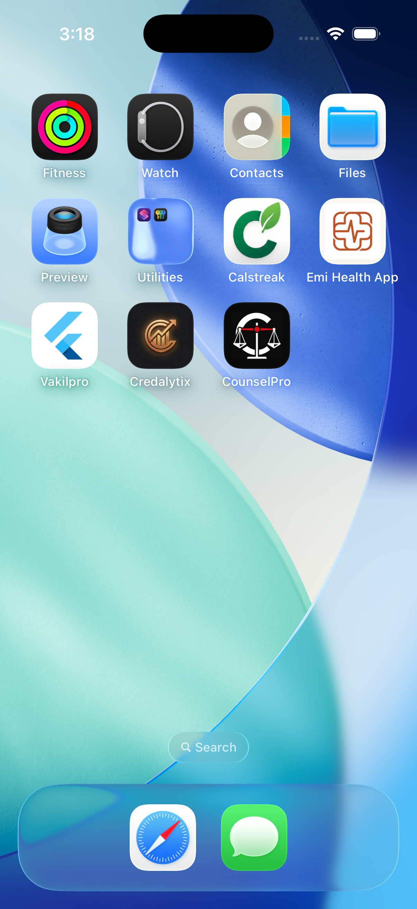 |
| *1-touch rapid dispatch to on-duty advocates for urgent bail or detention scenarios* | *Transparent hourly billing, escrow deposit protections, and multi-tier memberships* |

---

## ✨ Key Features

- **🤖 24/7 AI Legal Assistant**: Context-aware legal intelligence for statute lookup, plain-English legal explanations, and rapid contract OCR clause extraction.
- **🛡️ Bar Council Verified Advocates**: Direct matching with verified advocates filtered by court jurisdiction (High Court, Supreme Court, District Courts), specialization, win rate, and client ratings.
- **⚖️ 4-Stage Case Lifecycle Tracker**: Standardized milestone tracking (`Filed`, `Review`, `Hearing Scheduled`, `Resolved`) with cause list reminders to ensure deadlines are never missed.
- **🔒 Encrypted Case Vault**: Zero-trust, client-isolated cryptographic vault for pleadings, vakalatnamas, and sensitive legal evidence with in-app secure viewer.
- **🚨 1-Touch Emergency Legal SOS**: Instant geofenced dispatch connecting citizens and businesses with on-duty emergency criminal and civil counsel during critical legal situations.
- **💬 Confidential Communication Hub**: High-definition video, encrypted voice calling, and structured messaging built specifically for confidential legal consultations.
- **💳 Retainer & Escrow Billing**: Milestone-gated payments and transparent hourly tracking ensuring mutual trust between clients and practitioners.
- **💼 Advocate Practice Suite**: Dedicated dashboard for advocates to manage calendar availability, review incoming briefs, monitor KYC verification status, and analyze earnings.

---

## 👤 Who is CounselPro For?

1. **Clients & Businesses**:
   - Individuals navigating civil, criminal, matrimonial, or property matters.
   - Startups and SMEs requiring contract vetting, statutory compliance, and predictable retainer legal costs.
2. **Advocates & Legal Practitioners**:
   - Independent advocates seeking a modern mobile practice management suite.
   - Senior Counsel requiring centralized client communications and case vault access.
3. **Law Firms & Corporate Legal Departments**:
   - Distributed legal teams needing structured matter status tracking and tamper-evident document sharing.

---

## 🧭 How CounselPro Works

CounselPro orchestrates the full legal consultation lifecycle into 5 simple steps:

<div align="center">
  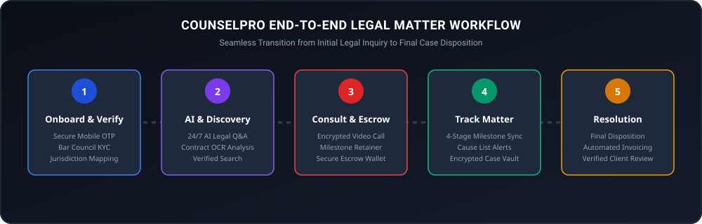
</div>

1. **Onboard & Verify**: Clients and advocates set up verified profiles with Bar Council credential verification.
2. **AI & Discovery**: Clients leverage the 24/7 AI assistant for preliminary legal summaries before selecting an advocate suited to their jurisdiction.
3. **Consult & Escrow**: Consultation fee is securely deposited in escrow; consultation takes place over encrypted video, audio, or in-person.
4. **Track Matter**: Active matters are managed across 4 synchronized milestones (`Filed`, `Review`, `Hearing`, `Resolved`) with secure vault storage.
5. **Resolution**: Final court orders are logged, the retainer is released upon milestone completion, and verified feedback is recorded.

---

## 💡 Why CounselPro?

- **Integrity by Design**: Eliminates unverified intermediaries by validating Bar Council credentials and court admissions.
- **Attorney-Client Privilege First**: Documents and discussions remain segregated in cryptographically isolated matter partitions.
- **Elimination of Case Tracking Chaos**: Replaces scattered messaging apps and missed cause lists with an automated 4-stage tracking engine.
- **Financial Predictability**: Escrow protections guarantee advocates are paid for work delivered while clients maintain control over disbursements.

---

## 🛠 High-Level Technology Stack

```
Mobile Application    │ Flutter (Dart) • Reactive Riverpod State • Custom Design System
Target Platforms      │ iOS • Android
Security & Storage    │ Client-Isolated Encrypted Vault Architecture • AES-256
Communications        │ Real-Time Messaging • WebRTC Audio/Video Consultation
Backend & Services    │ Scalable Microservices Architecture • Node.js
```

---

## 🏗 Conceptual Architecture

<div align="center">
  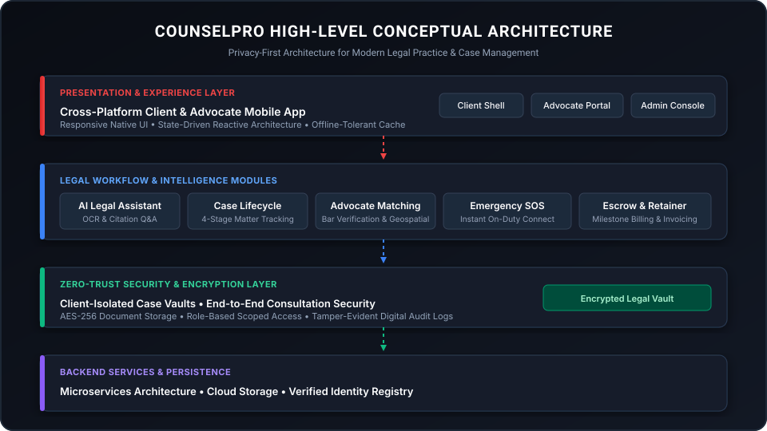
</div>

---

## 🔒 Privacy & Security Highlights

- **Client-Isolated Storage**: Every legal matter is sealed in an isolated vault partition with strict access controls.
- **Zero Third-Party Trackers**: No advertising SDKs, commercial telemetry, or behavioral tracking libraries.
- **Strict Role-Based Access (RBAC)**: Only assigned legal counsel and authorized clients can access privileged matter documents.
- **Ephemeral Incident Telemetry**: Emergency SOS coordinates are scrubbed after incident resolution.

*Read more in our [Privacy & Security Architecture Overview](docs/PRIVACY.md).*

---

## 🗺 Product Roadmap

- [x] **Phase 1**: Verified Advocate Directory & Geospatial Discovery
- [x] **Phase 2**: 24/7 AI Legal Assistant with Contract OCR
- [x] **Phase 3**: 4-Stage Matter Tracker & Encrypted Case Vault
- [x] **Phase 4**: 1-Touch Emergency Legal SOS Connect
- [x] **Phase 5**: Digital Retainer & Milestone Escrow Wallet
- [ ] **Phase 6**: Automated E-Courts Daily Cause List Sync
- [ ] **Phase 7**: Multi-Party Virtual Courtroom Video Sessions
- [ ] **Phase 8**: Regional Indian Court Language NLP Models

*Explore detailed milestones in our [Product Roadmap](docs/ROADMAP.md).*

---

## 📚 In-Depth Documentation

- [📘 Product Overview](docs/PRODUCT_OVERVIEW.md) — Problem statement, target personas, and market vision.
- [📋 Complete Feature Catalog](docs/FEATURES.md) — Comprehensive breakdown of every functional capability.
- [🔄 Operational Workflows](docs/WORKFLOW.md) — Step-by-step user journeys for clients and advocates.
- [🔒 Privacy Architecture](docs/PRIVACY.md) — Zero-trust design, privilege protection, and encryption philosophy.
- [🗺 Strategic Roadmap](docs/ROADMAP.md) — Near-term focus and long-term legaltech initiatives.

---

## ⚖️ Ownership & Intellectual Property

CounselPro is conceptualized, architected, and built by **Abhishek Bhatnagar** ([bhatnagar-built](https://github.com/bhatnagar-built)).

The CounselPro brand, user interface designs, proprietary algorithms, database schemas, and source code are proprietary. This repository is published strictly as a product showcase.

See [LICENSE](LICENSE) for terms of use.
